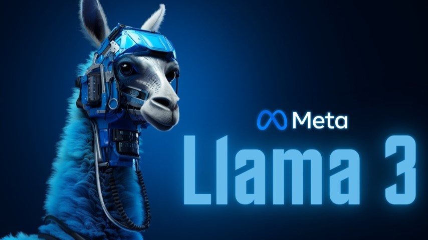

# Custom-Chatbot-with-Quantized-Llama3-8b

This repository contains the code and instructions for fine-tuning the LLaMA 3 8B model using unsloth and Low-Rank Adaptation (LoRA) for quantization. The fine-tuning process focuses on optimizing the model with LoRA adapters to create a custom chatbot on a custom dataset. Note that the model saved consists only of LoRA adapters, not the full model. To generate responses, the saved LoRA adapters must be merged with the base model.



## Table of Contents
- [Introduction](#introduction)
- [Fine-Tuning Process](#fine-tuning-process)
- [Installation](#installation)
- [Usage](#usage)
- [License](#license)

## Introduction

LLaMA 3 8B is a powerful language model, and fine-tuning it with LoRA and `unsloth` enables efficient adaptation for specific tasks. LoRA (Low-Rank Adaptation) allows for fine-tuning large models with fewer parameters by focusing on the key aspects that require adjustment, leading to significant memory and computational savings.

In this project, I use the `llama-3-8b-bnb-4bit` model from `unsloth`. This variant of the LLaMA 3 8B model is quantized to 4-bit precision, significantly reducing memory usage and computational requirements. This makes it feasible to fine-tune and deploy on hardware with limited resources while maintaining high performance.

## Fine-Tuning Process

The fine-tuning process leverages LoRA to adjust the LLaMA 3 8B model using the 4-bit quantized version provided by `unsloth`. Here is an outline of the steps:

1. Load the base model from Hugging Face.
2. Apply LoRA adapters to the model using `unsloth`.
3. Train the model on your specific task.
4. Save the LoRA adapters.

## Installation
To use the chatbot, you'll need to install the required packages. You can do this using pip:

``` python
!pip install transformers
!pip install bitsandbytes
!pip install accelerate
!pip install peft
```
## Usage
### merging-lora-adapters

To use the fine-tuned model, merge the saved LoRA adapters with the base model:
```python
from transformers import AutoModelForCausalLM, AutoTokenizer

# Replace 'your_model_name' with the name of your model on Hugging Face
model_name = "KhantKyaw/new_LLama3_CB"

# Load the model
model = AutoModelForCausalLM.from_pretrained(model_name, device_map="auto",low_cpu_mem_usage=True)

# Load the tokenizer
tokenizer = AutoTokenizer.from_pretrained(model_name)

# Now you can use 'model' and 'tokenizer' for inference or further training

model.load_adapter("KhantKyaw/lora2")
```

### Generating Responses

After merging the LoRA adapters, you can generate responses using the model:
```python
input_question = input('Enter the question: ')
inputs = tokenizer(
[
    f"<|start_header_id|>system<|end_header_id|> Given the instruction below, provide a clear and concise answer that directly addresses the request, taking into account any additional context provided<|eot_id|><|start_header_id|>user<|end_header_id|> This is the question: {input_question}<|eot_id|>"
], return_tensors = "pt").to("cuda")
outputs = model.generate(**inputs, max_new_tokens = 2048, use_cache = True)
answer = tokenizer.batch_decode(outputs, skip_special_tokens = True)

for text in answer:
    if 'assistant' in text:
        index = text.index('assistant')
        text_after_assistant = text[index + len('assistant'):]
        print(text_after_assistant.strip())
```
## License

This project is licensed under the MIT License - see the LICENSE file for details.
